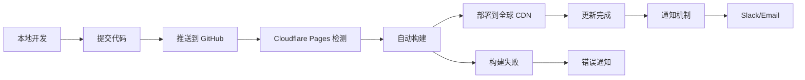

# Cloudflare Pages 自动部署配置指南

本文档详细介绍如何将技术面试知识库项目配置为推送代码到 GitHub 后自动部署到 Cloudflare Pages。

## 📋 前置条件

### 必需账户
- ✅ GitHub 账户
- ✅ Cloudflare 账户（免费版即可）

### 本地环境
- ✅ Node.js >= 16.0.0
- ✅ pnpm >= 8.0.0
- ✅ Git

## 🚀 第一步：准备 GitHub 仓库

### 1.1 创建 GitHub 仓库

```bash
# 方式一：GitHub 网页创建后克隆
git clone https://github.com/yourusername/tech-docs.git
cd tech-docs

# 方式二：本地项目推送到新仓库
git remote add origin https://github.com/yourusername/tech-docs.git
git branch -M main
git push -u origin main
```

### 1.2 配置 .gitignore

```bash
# 确保 .gitignore 包含以下内容
node_modules/
.temp/
.cache/
dist/
docs/.vitepress/cache/
docs/.vitepress/dist/
.env.local
.env.*.local
npm-debug.log*
pnpm-debug.log*
```

### 1.3 优化构建配置

检查并确保 `package.json` 中的构建脚本正确：

```json
{
  "scripts": {
    "docs:dev": "vitepress dev docs",
    "docs:build": "vitepress build docs",
    "docs:preview": "vitepress preview docs"
  }
}
```

## ⚙️ 第二步：配置 Cloudflare Pages

### 2.1 连接 GitHub 仓库

1. 登录 [Cloudflare Dashboard](https://dash.cloudflare.com/)
2. 点击左侧菜单 **Pages**
3. 点击 **Create a project**
4. 选择 **Connect to Git**
5. 授权 Cloudflare 访问你的 GitHub 账户
6. 选择 `tech-docs` 仓库

### 2.2 配置构建设置

在 Cloudflare Pages 的项目配置页面设置：

```yaml
项目名称: tech-docs
生产分支: main
构建命令: pnpm docs:build
构建输出目录: docs/.vitepress/dist
根目录: / (留空)
```

### 2.3 配置环境变量

点击 **Environment variables** 添加以下变量：

```bash
# Node.js 版本
NODE_VERSION=18

# 包管理器（可选，Cloudflare 会自动检测）
NPM_FLAGS=--version

# Google Analytics ID（如果需要）
GOOGLE_ANALYTICS_ID=G-XXXXXXXXXX
```

### 2.4 高级构建配置

如果需要更精确的控制，创建 `wrangler.toml` 文件：

```toml
name = "tech-docs"
compatibility_date = "2023-12-01"

[env.production]
compatibility_date = "2023-12-01"

# Pages 构建配置
[build]
command = "pnpm docs:build"
cwd = "."
publish = "docs/.vitepress/dist"

# 页面规则配置
[[redirects]]
from = "/old-path"
to = "/new-path"
status = 301

# 自定义头部（SEO 优化）
[[headers]]
for = "/*"
[headers.values]
X-Frame-Options = "DENY"
X-Content-Type-Options = "nosniff"
```

## 🔧 第三步：优化构建性能

### 3.1 添加构建缓存

创建 `.github/workflows/deploy.yml`（可选，用于 GitHub Actions 预构建）：

```yaml
name: Deploy to Cloudflare Pages
on:
  push:
    branches: [ main ]
  pull_request:
    branches: [ main ]

jobs:
  deploy:
    runs-on: ubuntu-latest
    steps:
      - name: Checkout
        uses: actions/checkout@v4

      - name: Setup Node.js
        uses: actions/setup-node@v4
        with:
          node-version: '18'

      - name: Setup pnpm
        uses: pnpm/action-setup@v2
        with:
          version: latest

      - name: Install dependencies
        run: pnpm install --frozen-lockfile

      - name: Build site
        run: pnpm docs:build

      - name: Deploy to Cloudflare Pages
        uses: cloudflare/pages-action@v1
        with:
          apiToken: ${{ secrets.CLOUDFLARE_API_TOKEN }}
          accountId: ${{ secrets.CLOUDFLARE_ACCOUNT_ID }}
          projectName: tech-docs
          directory: docs/.vitepress/dist
          wranglerVersion: '3'
```

### 3.2 添加依赖优化

在 `docs/.vitepress/config.mts` 中添加构建优化：

```typescript
export default defineConfig({
  // ... 其他配置

  vite: {
    plugins: [
      // 现有插件...
    ],
    build: {
      // 分块策略优化
      rollupOptions: {
        output: {
          manualChunks: {
            vendor: ['vue', 'vitepress'],
            ui: ['medium-zoom']
          }
        }
      },
      // 构建目标优化
      target: 'esnext',
      minify: 'terser'
    },
    // 依赖优化
    optimizeDeps: {
      exclude: ['@ai-sdk/provider-utils'],
      include: ['medium-zoom', 'mermaid']
    }
  }
})
```

## 🌐 第四步：自定义域名配置

### 4.1 添加自定义域名

1. 在 Cloudflare Pages 项目中点击 **Custom domains**
2. 点击 **Set up a custom domain**
3. 输入你的域名（如：`tech-docs.example.com`）
4. 按照提示配置 DNS 记录

### 4.2 DNS 配置示例

如果你的域名也托管在 Cloudflare：

```
类型: CNAME
名称: tech-docs
目标: your-project.pages.dev
代理: 开启 (橙色云朵)
```

如果域名在其他服务商：

```
类型: CNAME
主机: tech-docs
值: your-project.pages.dev
TTL: 自动或 300
```

## 🔍 第五步：部署验证与监控

### 5.1 验证部署

1. **检查构建日志**：在 Cloudflare Pages 查看构建状态
2. **测试访问**：访问 `your-project.pages.dev`
3. **功能验证**：测试搜索、导航、主题切换等功能

### 5.2 性能监控

配置 Cloudflare Analytics：

```typescript
// 在 config.mts 中添加
head: [
  // 现有配置...
  ['script', {
    src: 'https://static.cloudflareinsights.com/beacon.min.js',
    'data-cf-beacon': '{"token": "YOUR_CF_TOKEN"}'
  }]
]
```

### 5.3 SEO 优化

添加 sitemap 和 robots.txt：

```typescript
// config.mts
export default defineConfig({
  sitemap: {
    hostname: 'https://your-domain.com'
  },

  head: [
    ['meta', { name: 'robots', content: 'index,follow' }],
    ['meta', { name: 'googlebot', content: 'index,follow' }]
  ]
})
```

## 🛠️ 自动化工作流程

### 完整的部署流程



### 部署通知配置

创建 `.github/workflows/notify.yml`：

```yaml
name: Deployment Notification
on:
  workflow_run:
    workflows: ["Deploy to Cloudflare Pages"]
    types:
      - completed

jobs:
  notify:
    runs-on: ubuntu-latest
    if: ${{ github.event.workflow_run.conclusion == 'success' }}
    steps:
      - name: Send success notification
        run: |
          echo "✅ 部署成功！"
          echo "🌐 站点地址: https://your-project.pages.dev"
```

## 📊 部署优化建议

### 性能优化
- ✅ 启用 Cloudflare 的 **Auto Minify**
- ✅ 开启 **Brotli 压缩**
- ✅ 配置 **Browser Cache TTL**
- ✅ 使用 **Image Optimization**

### 安全配置
- ✅ 启用 **HTTPS** 重定向
- ✅ 配置 **Security Headers**
- ✅ 设置 **WAF 规则**（如需要）

### 监控报警
- ✅ 配置 **Uptime Monitor**
- ✅ 设置 **Error Tracking**
- ✅ 启用 **Real User Monitoring**

## 🔧 故障排除

### 常见问题

#### 构建失败

```bash
# 检查本地构建
pnpm docs:build

# 检查依赖版本
pnpm list --depth=0

# 清理缓存
pnpm store prune
rm -rf node_modules docs/.vitepress/cache
pnpm install
```

#### 404 错误

```typescript
// 检查 base 配置
export default defineConfig({
  base: '/', // 确保为正确路径
  cleanUrls: true // 启用简洁 URL
})
```

#### 静态资源加载失败

```typescript
// 确保正确的资源路径配置
export default defineConfig({
  head: [
    ['link', { rel: 'icon', href: '/favicon.ico' }], // 使用绝对路径
  ]
})
```

## 📚 相关资源

- [Cloudflare Pages 官方文档](https://developers.cloudflare.com/pages/)
- [VitePress 部署指南](https://vitepress.dev/guide/deploy)
- [GitHub Actions 文档](https://docs.github.com/en/actions)

---

**完成上述配置后，每次推送代码到 main 分支，Cloudflare Pages 都会自动检测变更并重新部署网站。整个过程通常在 2-5 分钟内完成。**