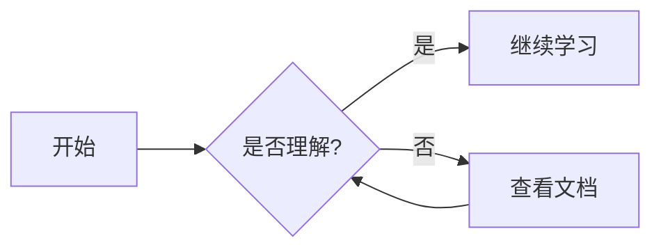

# 架构图

使用 Mermaid 绘制的技术架构图，帮助可视化理解系统设计。

## 图表列表

### 前端架构
- [Vue 架构图](./vue-architecture.mmd)
- [React 架构图](./react-architecture.mmd)
- [TypeScript 架构图](./typescript-architecture.mmd)
- [Webpack/Vite 架构图](./webpack-vite-architecture.mmd)

### 后端架构
- [Java 架构图](./java-architecture.mmd)
- [Node.js 架构图](./nodejs-architecture.mmd)
- [Python 架构图](./python-architecture.mmd)
- [Spring Boot 架构图](./spring-boot-architecture.mmd)
- [Spring Cloud 架构图](./spring-cloud-architecture.mmd)

### 数据库架构
- [MySQL 架构图](./mysql-architecture.mmd)
- [Redis 架构图](./redis-architecture.mmd)
- [MongoDB 架构图](./mongodb-architecture.mmd)
- [Kafka 架构图](./kafka-architecture.mmd)

### DevOps 架构
- [Docker 架构图](./docker-architecture.mmd)
- [Kubernetes 架构图](./kubernetes-architecture.mmd)
- [HTTP 架构图](./http-architecture.mmd)
- [Git 架构图](./git-architecture.mmd)

## 使用说明

本项目使用 `vitepress-plugin-mermaid` 插件支持 Mermaid 图表渲染。

::: tip 提示
Mermaid 图表支持流程图、时序图、类图、状态图等多种类型。
:::
