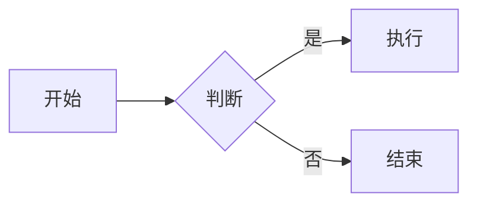

# VitePress 插件模块

本项目集成了多个 VitePress 插件，以增强文档的功能和用户体验。

## 插件概览

| 插件名称 | 功能说明 | 状态 |
|---------|---------|------|
| vitepress-plugin-mermaid | Mermaid 图表支持 | 已集成 |
| vitepress-sidebar | 自动侧边栏生成 | 已配置 |
| vitepress-plugin-tabs | 代码/内容标签页 | 已集成 |
| medium-zoom | 图片点击放大 | 已集成 |
| vitepress-plugin-back-to-top | 返回顶部按钮 | 已集成 |
| @mdit/plugin-katex | 数学公式渲染 | 已集成 |
| markdown-it-* | Markdown 增强插件 | 已集成 |
| busuanzi | 访客统计 | 已集成 |
| UnoCSS | 原子化 CSS 框架 | 已集成 |
| vitepress-plugin-llms | AI/LLM 集成 | 已配置 |

---

## 1. Mermaid 图表插件

### 简介
[vitepress-plugin-mermaid](https://github.com/emersonbottero/vitepress-plugin-mermaid) 为 VitePress 提供 Mermaid 图表渲染支持。

### 安装
```bash
pnpm add -D vitepress-plugin-mermaid mermaid
```

### 配置
```ts
// .vitepress/config.mts
import { withMermaid } from 'vitepress-plugin-mermaid'

export default withMermaid(
  defineConfig({
    mermaid: {
      theme: 'default',
    },
  })
)
```

### 使用示例

````markdown

````

### 效果展示


---

## 2. 自动侧边栏插件

### 简介
[vitepress-sidebar](https://github.com/jooy2/vitepress-sidebar) 根据文件目录结构自动生成侧边栏配置。

### 安装
```bash
pnpm add -D vitepress-sidebar
```

### 配置
```ts
// .vitepress/config.mts
import { withSidebar } from 'vitepress-sidebar'

const vitePressOptions = {
  // VitePress 配置
}

const sidebarOptions = {
  documentRootPath: '/docs',
  useTitleFromFileHeading: true,
  hyphenToSpace: true,
  collapsed: true,
}

export default defineConfig(
  withSidebar(vitePressOptions, sidebarOptions)
)
```

### 配置选项

| 选项 | 说明 | 默认值 |
|-----|------|-------|
| `documentRootPath` | 文档根目录 | `/docs` |
| `useTitleFromFileHeading` | 从文件标题获取菜单名 | `true` |
| `collapsed` | 默认折叠 | `true` |
| `hyphenToSpace` | 连字符转空格 | `true` |

---

## 3. Tabs 标签页插件

### 简介
[vitepress-plugin-tabs](https://github.com/sapphi-red/vitepress-plugin-tabs) 支持在 Markdown 中创建标签页。

### 安装
```bash
pnpm add -D vitepress-plugin-tabs
```

### 配置
```ts
// .vitepress/config.mts
import { tabsMarkdownPlugin } from 'vitepress-plugin-tabs'

export default defineConfig({
  markdown: {
    config: (md) => {
      md.use(tabsMarkdownPlugin)
    },
  },
})
```

```ts
// .vitepress/theme/index.ts
import { enhanceAppWithTabs } from 'vitepress-plugin-tabs/client'

export default {
  enhanceApp({ app }) {
    enhanceAppWithTabs(app)
  },
}
```

### 使用示例

```markdown
:::tabs key:pm
== npm
npm install package-name

== yarn
yarn add package-name

== pnpm
pnpm add package-name
:::
```

---

## 4. 图片缩放插件

### 简介
[medium-zoom](https://github.com/francoischalifour/medium-zoom) 提供类似 Medium 的图片点击放大效果。

### 安装
```bash
pnpm add -D medium-zoom
```

### 配置
```ts
// .vitepress/theme/index.ts
import mediumZoom from 'medium-zoom'
import { onMounted, watch, nextTick } from 'vue'
import { useRoute } from 'vitepress'

export default {
  setup() {
    const route = useRoute()

    const initZoom = () => {
      mediumZoom('.main img', {
        background: 'var(--vp-c-bg)',
        margin: 24
      })
    }

    onMounted(() => initZoom())

    watch(
      () => route.path,
      () => nextTick(() => initZoom())
    )
  }
}
```

### 配置选项

| 选项 | 说明 | 默认值 |
|-----|------|-------|
| `background` | 遮罩背景色 | `#fff` |
| `margin` | 图片边距 | `0` |
| `scrollOffset` | 滚动偏移关闭 | `40` |
| `container` | 自定义容器 | `null` |

---

## 5. 返回顶部插件

### 简介
[vitepress-plugin-back-to-top](https://github.com/wehuss/vitepress-plugin-back-to-top) 添加返回顶部按钮。

### 安装
```bash
pnpm add -D vitepress-plugin-back-to-top
```

### 配置
```ts
// .vitepress/theme/index.ts
import vitepressBackToTop from 'vitepress-plugin-back-to-top'
import 'vitepress-plugin-back-to-top/dist/style.css'

export default {
  enhanceApp({ app }) {
    vitepressBackToTop({
      threshold: 300 // 滚动 300px 后显示
    })
  },
}
```

---

## 6. KaTeX 数学公式插件

### 简介
[@mdit/plugin-katex](https://github.com/mdit-plugins/mdit-plugins) 支持 LaTeX 数学公式渲染。

### 安装
```bash
pnpm add -D @mdit/plugin-katex katex
```

### 配置
```ts
// .vitepress/config.mts
import { katex } from '@mdit/plugin-katex'

export default defineConfig({
  head: [
    ['link', {
      rel: 'stylesheet',
      href: 'https://cdn.jsdelivr.net/npm/katex@0.16.11/dist/katex.min.css'
    }],
  ],
  markdown: {
    config: (md) => {
      md.use(katex)
    },
  },
})
```

### 使用示例

**行内公式**：
```markdown
质能方程 $E = mc^2$ 是物理学中最著名的公式。
```

**块级公式**：
```markdown
$$
\frac{-b \pm \sqrt{b^2 - 4ac}}{2a}
$$
```

### 效果展示

质能方程 $E = mc^2$ 是物理学中最著名的公式。

$$
\frac{-b \pm \sqrt{b^2 - 4ac}}{2a}
$$

---

## 7. Markdown-it 插件集

### 7.1 脚注插件 (markdown-it-footnote)

**安装**：
```bash
pnpm add -D markdown-it-footnote
```

**使用示例**：
```markdown
这是一个脚注引用[^1]。

[^1]: 这是脚注的内容。
```

### 7.2 高亮标记插件 (markdown-it-mark)

**安装**：
```bash
pnpm add -D markdown-it-mark
```

**使用示例**：
```markdown
这是 ==高亮标记== 文本。
```

### 7.3 上下标插件 (markdown-it-sub/sup)

**安装**：
```bash
pnpm add -D markdown-it-sub markdown-it-sup
```

**使用示例**：
```markdown
H~2~O 是水的化学式。
E = mc^2^ 是质能方程。
```

### 7.4 任务列表插件 (markdown-it-task-lists)

**安装**：
```bash
pnpm add -D markdown-it-task-lists
```

**使用示例**：
```markdown
- [x] 已完成任务
- [ ] 未完成任务
- [ ] 待办事项
```

### 配置汇总

```ts
// .vitepress/config.mts
import footnote from 'markdown-it-footnote'
import mark from 'markdown-it-mark'
import sub from 'markdown-it-sub'
import sup from 'markdown-it-sup'
import taskLists from 'markdown-it-task-lists'

export default defineConfig({
  markdown: {
    config: (md) => {
      md.use(footnote)
      md.use(mark)
      md.use(sub)
      md.use(sup)
      md.use(taskLists)
    },
  },
})
```

---

## 8. 不蒜子访客统计

### 简介
[不蒜子](https://busuanzi.ibruce.info/) 是一个极简的网站计数服务，无需注册即可使用。

### 安装
```bash
pnpm add -D busuanzi.pure.js
```

### 配置

**方式一：通过 Head 引入**
```ts
// .vitepress/config.mts
export default defineConfig({
  head: [
    ['script', {
      async: '',
      src: '//busuanzi.ibruce.info/busuanzi/2.3/busuanzi.pure.mini.js'
    }],
  ],
})
```

**方式二：在组件中使用**
```vue
<template>
  <div class="busuanzi-container">
    <span>本站访问量：<span id="busuanzi_value_site_pv"></span> 次</span>
    <span>访客数：<span id="busuanzi_value_site_uv"></span> 人</span>
  </div>
</template>

<script setup>
import { onMounted } from 'vue'
import busuanzi from 'busuanzi.pure.js'

onMounted(() => {
  busuanzi.fetch()
})
</script>
```

### 统计类型

| ID | 说明 |
|----|------|
| `busuanzi_value_site_pv` | 站点总访问量 |
| `busuanzi_value_site_uv` | 站点访客数 |
| `busuanzi_value_page_pv` | 当前页面访问量 |

---

## 9. UnoCSS 原子化 CSS

### 简介
[UnoCSS](https://unocss.dev/) 是即时原子化 CSS 引擎，比 Tailwind CSS 更快更轻量。

### 安装
```bash
pnpm add -D unocss @unocss/reset
```

### 配置

**uno.config.ts**
```ts
import { defineConfig, presetUno, presetAttributify, presetIcons } from 'unocss'

export default defineConfig({
  presets: [
    presetUno(),
    presetAttributify(),
    presetIcons({
      scale: 1.2,
      warn: true,
    }),
  ],
  shortcuts: {
    'flex-center': 'flex items-center justify-center',
    'flex-between': 'flex items-center justify-between',
  },
})
```

**VitePress 配置**
```ts
// .vitepress/config.mts
import UnoCSS from 'unocss/vite'

export default defineConfig({
  vite: {
    plugins: [UnoCSS()],
  },
})
```

**主题引入**
```ts
// .vitepress/theme/index.ts
import 'virtual:uno.css'
```

### 使用示例
```html
<div class="flex-center p-4 bg-blue-500 text-white rounded-lg">
  原子化 CSS 示例
</div>
```

---

## 10. AI/LLM 集成插件

### 简介
[vitepress-plugin-llms](https://github.com/okineadev/vitepress-plugin-llms) 为文档站点生成适合 LLM 训练的文件。

### 安装
```bash
pnpm add -D vitepress-plugin-llms
```

### 配置
```ts
// .vitepress/config.mts
import llmstxtPlugin from 'vitepress-plugin-llms'

export default defineConfig({
  vite: {
    plugins: [
      llmstxtPlugin({
        hostname: 'https://your-domain.com',
        llmsFullFile: true,
      })
    ],
  },
})
```

### 功能特点

- 自动生成 `llms.txt` 文件
- 支持自定义 LLM 训练数据格式
- 可配置忽略特定页面
- 支持元数据自定义

---

## 11. PDF 导出插件

### 简介
[vitepress-export-pdf](https://github.com/condorheroblog/vitepress-export-pdf) 支持将文档导出为 PDF。

### 安装
```bash
pnpm add -D vitepress-export-pdf
```

### 配置
```ts
// .vitepress/export-pdf.config.ts
import { defineUserConfig } from 'vitepress-export-pdf'

export default defineUserConfig({
  pdfOptions: {
    format: 'A4',
    margin: {
      top: '40px',
      bottom: '40px',
    },
  },
})
```

### 使用命令
```bash
npx vitepress-export-pdf export docs
```

---

## 插件开发指南

### 创建自定义插件

```ts
// my-plugin.ts
import type { Plugin } from 'vite'

export function myVitePressPlugin(): Plugin {
  return {
    name: 'vitepress-plugin-custom',
    enforce: 'pre',
    transform(code, id) {
      // 转换逻辑
      return code
    },
  }
}
```

### 创建 Markdown-it 插件

```ts
// my-md-plugin.ts
import type MarkdownIt from 'markdown-it'

export function myMarkdownPlugin(md: MarkdownIt) {
  md.inline.ruler.before('emphasis', 'my-rule', (state, silent) => {
    // 解析逻辑
    return false
  })
}
```

---

## 常见问题

### Q: 插件加载顺序有影响吗？
A: 是的，某些插件需要特定的加载顺序。一般建议：
1. 先加载基础配置插件
2. 再加载 Markdown 增强插件
3. 最后加载 UI 增强插件

### Q: 如何调试插件？
A: 可以使用 `vite --debug` 模式查看插件加载情况。

### Q: 插件冲突如何解决？
A: 检查插件是否有相同的钩子或修改相同的内容，必要时调整加载顺序或使用条件加载。

---

## 参考资源

- [VitePress 官方文档](https://vitepress.dev/)
- [Vite 插件 API](https://vitejs.dev/guide/api-plugin.html)
- [Markdown-it 文档](https://markdown-it.github.io/)
- [UnoCSS 文档](https://unocss.dev/)
- [KaTeX 文档](https://katex.org/)
