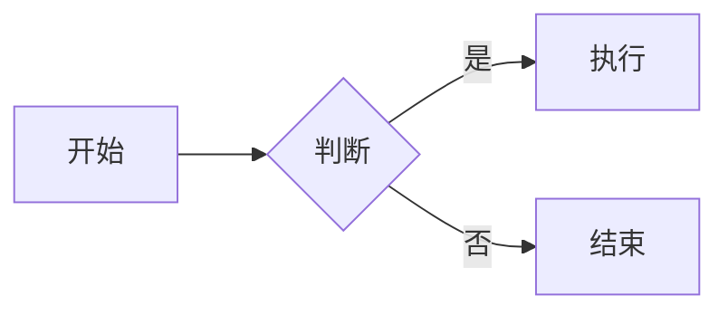

# VitePress 插件模块

本项目集成了多个 VitePress 插件，以增强文档的功能和用户体验。

## 插件概览

| 插件名称 | 功能说明 | 状态 |
|---------|---------|------|
| vitepress-plugin-mermaid | Mermaid 图表支持 | 已集成 |
| vitepress-sidebar | 自动侧边栏生成 | 已配置 |
| vitepress-plugin-tabs | 代码/内容标签页 | 已集成 |
| medium-zoom | 图片点击放大 | 已集成 |
| vitepress-plugin-back-to-top | 返回顶部按钮 | 已集成 |
| @mdit/plugin-katex | 数学公式渲染 | 已集成 |
| markdown-it-* | Markdown 增强插件 | 已集成 |
| busuanzi | 访客统计 | 已集成 |
| UnoCSS | 原子化 CSS 框架 | 已集成 |
| vitepress-plugin-llms | AI/LLM 集成 | 已配置 |

---

## 1. Mermaid 图表插件

### 简介
[vitepress-plugin-mermaid](https://github.com/emersonbottero/vitepress-plugin-mermaid) 为 VitePress 提供 Mermaid 图表渲染支持。

### 安装
```bash
pnpm add -D vitepress-plugin-mermaid mermaid
```

### 配置
```ts
// .vitepress/config.mts
import { withMermaid } from 'vitepress-plugin-mermaid'

export default withMermaid(
  defineConfig({
    mermaid: {
      theme: 'default',
    },
  })
)
```

### 使用示例

````markdown

```mermaid
graph LR
    A[开始] --> B{判断}
    B -->|是| C[执行]
    B -->|否| D[结束]
```
````

### 效果展示


```mermaid
graph LR
    A[开始] --> B{判断}
    B -->|是| C[执行]
    B -->|否| D[结束]
```

---

## 2. 自动侧边栏插件

### 简介
[vitepress-sidebar](https://github.com/jooy2/vitepress-sidebar) 根据文件目录结构自动生成侧边栏配置。

### 安装
```bash
pnpm add -D vitepress-sidebar
```

### 配置
```ts
// .vitepress/config.mts
import { withSidebar } from 'vitepress-sidebar'

const vitePressOptions = {
  // VitePress 配置
}

const sidebarOptions = {
  documentRootPath: '/docs',
  useTitleFromFileHeading: true,
  hyphenToSpace: true,
  collapsed: true,
}

export default defineConfig(
  withSidebar(vitePressOptions, sidebarOptions)
)
```

### 配置选项

| 选项 | 说明 | 默认值 |
|-----|------|-------|
| `documentRootPath` | 文档根目录 | `/docs` |
| `useTitleFromFileHeading` | 从文件标题获取菜单名 | `true` |
| `collapsed` | 默认折叠 | `true` |
| `hyphenToSpace` | 连字符转空格 | `true` |

---

## 3. Tabs 标签页插件

### 简介
[vitepress-plugin-tabs](https://github.com/sapphi-red/vitepress-plugin-tabs) 支持在 Markdown 中创建标签页。

### 安装
```bash
pnpm add -D vitepress-plugin-tabs
```

### 配置
```ts
// .vitepress/config.mts
import { tabsMarkdownPlugin } from 'vitepress-plugin-tabs'

export default defineConfig({
  markdown: {
    config: (md) => {
      md.use(tabsMarkdownPlugin)
    },
  },
})
```

```ts
// .vitepress/theme/index.ts
import { enhanceAppWithTabs } from 'vitepress-plugin-tabs/client'

export default {
  enhanceApp({ app }) {
    enhanceAppWithTabs(app)
  },
}
```

### 使用示例

```markdown
:::tabs key:pm
== npm
npm install package-name

== yarn
yarn add package-name

== pnpm
pnpm add package-name
:::
```

---

## 4. 图片缩放插件

### 简介
[medium-zoom](https://github.com/francoischalifour/medium-zoom) 提供类似 Medium 的图片点击放大效果。

### 安装
```bash
pnpm add -D medium-zoom
```

### 配置
```ts
// .vitepress/theme/index.ts
import mediumZoom from 'medium-zoom'
import { onMounted, watch, nextTick } from 'vue'
import { useRoute } from 'vitepress'

export default {
  setup() {
    const route = useRoute()

    const initZoom = () => {
      mediumZoom('.main img', {
        background: 'var(--vp-c-bg)',
        margin: 24
      })
    }

    onMounted(() => initZoom())

    watch(
      () => route.path,
      () => nextTick(() => initZoom())
    )
  }
}
```

### 配置选项

| 选项 | 说明 | 默认值 |
|-----|------|-------|
| `background` | 遮罩背景色 | `#fff` |
| `margin` | 图片边距 | `0` |
| `scrollOffset` | 滚动偏移关闭 | `40` |
| `container` | 自定义容器 | `null` |

---

## 5. 返回顶部插件

### 简介
[vitepress-plugin-back-to-top](https://github.com/wehuss/vitepress-plugin-back-to-top) 添加返回顶部按钮。

### 安装
```bash
pnpm add -D vitepress-plugin-back-to-top
```

### 配置
```ts
// .vitepress/theme/index.ts
import vitepressBackToTop from 'vitepress-plugin-back-to-top'
import 'vitepress-plugin-back-to-top/dist/style.css'

export default {
  enhanceApp({ app }) {
    vitepressBackToTop({
      threshold: 300 // 滚动 300px 后显示
    })
  },
}
```

---

## 6. KaTeX 数学公式插件

### 简介
[@mdit/plugin-katex](https://github.com/mdit-plugins/mdit-plugins) 支持 LaTeX 数学公式渲染。

### 安装
```bash
pnpm add -D @mdit/plugin-katex katex
```

### 配置
```ts
// .vitepress/config.mts
import { katex } from '@mdit/plugin-katex'

export default defineConfig({
  head: [
    ['link', {
      rel: 'stylesheet',
      href: 'https://cdn.jsdelivr.net/npm/katex@0.16.11/dist/katex.min.css'
    }],
  ],
  markdown: {
    config: (md) => {
      md.use(katex)
    },
  },
})
```

### 使用示例

**行内公式**：
```markdown
质能方程 $E = mc^2$ 是物理学中最著名的公式。
```

**块级公式**：
```markdown
$$
\frac{-b \pm \sqrt{b^2 - 4ac}}{2a}
$$
```

### 效果展示

质能方程 $E = mc^2$ 是物理学中最著名的公式。

$$
\frac{-b \pm \sqrt{b^2 - 4ac}}{2a}
$$

---

## 7. Markdown-it 插件集

### 7.1 脚注插件 (markdown-it-footnote)

**安装**：
```bash
pnpm add -D markdown-it-footnote
```

**使用示例**：
```markdown
这是一个脚注引用[^1]。

[^1]: 这是脚注的内容。
```

### 7.2 高亮标记插件 (markdown-it-mark)

**安装**：
```bash
pnpm add -D markdown-it-mark
```

**使用示例**：
```markdown
这是 ==高亮标记== 文本。
```

### 7.3 上下标插件 (markdown-it-sub/sup)

**安装**：
```bash
pnpm add -D markdown-it-sub markdown-it-sup
```

**使用示例**：
```markdown
H~2~O 是水的化学式。
E = mc^2^ 是质能方程。
```

### 7.4 任务列表插件 (markdown-it-task-lists)

**安装**：
```bash
pnpm add -D markdown-it-task-lists
```

**使用示例**：
```markdown
- [x] 已完成任务
- [ ] 未完成任务
- [ ] 待办事项
```

### 配置汇总

```ts
// .vitepress/config.mts
import footnote from 'markdown-it-footnote'
import mark from 'markdown-it-mark'
import sub from 'markdown-it-sub'
import sup from 'markdown-it-sup'
import taskLists from 'markdown-it-task-lists'

export default defineConfig({
  markdown: {
    config: (md) => {
      md.use(footnote)
      md.use(mark)
      md.use(sub)
      md.use(sup)
      md.use(taskLists)
    },
  },
})
```

---

## 8. 不蒜子访客统计

### 简介
[不蒜子](https://busuanzi.ibruce.info/) 是一个极简的网站计数服务，无需注册即可使用。

### 安装
```bash
pnpm add -D busuanzi.pure.js
```

### 配置

**方式一：通过 Head 引入**
```ts
// .vitepress/config.mts
export default defineConfig({
  head: [
    ['script', {
      async: '',
      src: '//busuanzi.ibruce.info/busuanzi/2.3/busuanzi.pure.mini.js'
    }],
  ],
})
```

**方式二：在组件中使用**
```vue
<template>
  <div class="busuanzi-container">
    <span>本站访问量：<span id="busuanzi_value_site_pv"></span> 次</span>
    <span>访客数：<span id="busuanzi_value_site_uv"></span> 人</span>
  </div>
</template>

<script setup>
import { onMounted } from 'vue'
import busuanzi from 'busuanzi.pure.js'

onMounted(() => {
  busuanzi.fetch()
})
</script>
```

### 统计类型

| ID | 说明 |
|----|------|
| `busuanzi_value_site_pv` | 站点总访问量 |
| `busuanzi_value_site_uv` | 站点访客数 |
| `busuanzi_value_page_pv` | 当前页面访问量 |

---

## 9. UnoCSS 原子化 CSS

### 简介
[UnoCSS](https://unocss.dev/) 是即时原子化 CSS 引擎，比 Tailwind CSS 更快更轻量。

### 安装
```bash
pnpm add -D unocss @unocss/reset
```

### 配置

**uno.config.ts**
```ts
import { defineConfig, presetUno, presetAttributify, presetIcons } from 'unocss'

export default defineConfig({
  presets: [
    presetUno(),
    presetAttributify(),
    presetIcons({
      scale: 1.2,
      warn: true,
    }),
  ],
  shortcuts: {
    'flex-center': 'flex items-center justify-center',
    'flex-between': 'flex items-center justify-between',
  },
})
```

**VitePress 配置**
```ts
// .vitepress/config.mts
import UnoCSS from 'unocss/vite'

export default defineConfig({
  vite: {
    plugins: [UnoCSS()],
  },
})
```

**主题引入**
```ts
// .vitepress/theme/index.ts
import 'virtual:uno.css'
```

### 使用示例
```html
<div class="flex-center p-4 bg-blue-500 text-white rounded-lg">
  原子化 CSS 示例
</div>
```

---

## 10. AI/LLM 集成插件

### 简介
[vitepress-plugin-llms](https://github.com/okineadev/vitepress-plugin-llms) 为文档站点生成适合 LLM 训练的文件。

### 安装
```bash
pnpm add -D vitepress-plugin-llms
```

### 配置
```ts
// .vitepress/config.mts
import llmstxtPlugin from 'vitepress-plugin-llms'

export default defineConfig({
  vite: {
    plugins: [
      llmstxtPlugin({
        hostname: 'https://your-domain.com',
        llmsFullFile: true,
      })
    ],
  },
})
```

### 功能特点

- 自动生成 `llms.txt` 文件
- 支持自定义 LLM 训练数据格式
- 可配置忽略特定页面
- 支持元数据自定义

---

## 11. PDF 导出插件

### 简介
[vitepress-export-pdf](https://github.com/condorheroblog/vitepress-export-pdf) 支持将文档导出为 PDF。

### 安装
```bash
pnpm add -D vitepress-export-pdf
```

### 配置
```ts
// .vitepress/export-pdf.config.ts
import { defineUserConfig } from 'vitepress-export-pdf'

export default defineUserConfig({
  pdfOptions: {
    format: 'A4',
    margin: {
      top: '40px',
      bottom: '40px',
    },
  },
})
```

### 使用命令
```bash
npx vitepress-export-pdf export docs
```

---

## 插件开发指南

### 创建自定义插件

```ts
// my-plugin.ts
import type { Plugin } from 'vite'

export function myVitePressPlugin(): Plugin {
  return {
    name: 'vitepress-plugin-custom',
    enforce: 'pre',
    transform(code, id) {
      // 转换逻辑
      return code
    },
  }
}
```

### 创建 Markdown-it 插件

```ts
// my-md-plugin.ts
import type MarkdownIt from 'markdown-it'

export function myMarkdownPlugin(md: MarkdownIt) {
  md.inline.ruler.before('emphasis', 'my-rule', (state, silent) => {
    // 解析逻辑
    return false
  })
}
```

---

## 常见问题

### Q: 插件加载顺序有影响吗？
A: 是的，某些插件需要特定的加载顺序。一般建议：
1. 先加载基础配置插件
2. 再加载 Markdown 增强插件
3. 最后加载 UI 增强插件

### Q: 如何调试插件？
A: 可以使用 `vite --debug` 模式查看插件加载情况。

### Q: 插件冲突如何解决？
A: 检查插件是否有相同的钩子或修改相同的内容，必要时调整加载顺序或使用条件加载。

---

## 参考资源

- [VitePress 官方文档](https://vitepress.dev/)
- [Vite 插件 API](https://vitejs.dev/guide/api-plugin.html)
- [Markdown-it 文档](https://markdown-it.github.io/)
- [UnoCSS 文档](https://unocss.dev/)
- [KaTeX 文档](https://katex.org/)


---

## 12. 代码块折叠插件

### 简介
[vitepress-plugin-codeblocks-fold](https://github.com/T-miracle/vitepress-plugin-codeblocks-fold) 为长代码块添加折叠功能。

### 安装
```bash
pnpm add -D vitepress-plugin-codeblocks-fold
```

### 配置
```ts
// .vitepress/theme/index.ts
import codeblocksFold from 'vitepress-plugin-codeblocks-fold'
import 'vitepress-plugin-codeblocks-fold/style/index.css'

export default {
  enhanceApp({ app }) {
    app.use(codeblocksFold)
  },
}
```

### 功能特点
- 自动为超过指定行数的代码块添加折叠按钮
- 支持自定义折叠阈值
- 保持代码高亮和复制功能
- 响应式设计

### 配置选项
```ts
app.use(codeblocksFold, {
  // 超过多少行显示折叠按钮
  height: 300,
  // 折叠按钮文本
  foldText: '展开',
  unfoldText: '收起'
})
```

---

## 13. Giscus 评论插件

### 简介
[vitepress-plugin-comment-with-giscus](https://github.com/T-miracle/vitepress-plugin-comment-with-giscus) 基于 GitHub Discussions 的评论系统。

### 安装
```bash
pnpm add -D vitepress-plugin-comment-with-giscus
```

### 前置条件
1. GitHub 仓库必须是公开的
2. 在仓库中启用 Discussions 功能
3. 安装 [Giscus App](https://github.com/apps/giscus)

### 配置
```ts
// .vitepress/theme/index.ts
import giscusTalk from 'vitepress-plugin-comment-with-giscus'
import { useData, useRoute } from 'vitepress'

export default {
  enhanceApp({ app }) {
    app.component('GiscusComment', giscusTalk({
      repo: 'your-username/your-repo',
      repoId: 'your-repo-id',
      category: 'Announcements',
      categoryId: 'your-category-id',
      mapping: 'pathname',
      inputPosition: 'top',
      lang: 'zh-CN',
      lightTheme: 'light',
      darkTheme: 'dark',
    }, {
      frontmatter: useData().frontmatter.value,
      route: useRoute()
    }))
  },
}
```

### 在页面中使用
```vue
<template>
  <div>
    <!-- 页面内容 -->
    <GiscusComment />
  </div>
</template>
```

### 配置选项

| 选项 | 说明 | 必填 |
|-----|------|------|
| `repo` | GitHub 仓库 | 是 |
| `repoId` | 仓库 ID | 是 |
| `category` | Discussion 分类 | 是 |
| `categoryId` | 分类 ID | 是 |
| `mapping` | 页面映射方式 | 否 |
| `lang` | 语言 | 否 |

---

## 14. Google Analytics 插件

### 简介
[vitepress-plugin-google-analytics](https://github.com/ZhongxuYang/vitepress-plugin-google-analytics) 集成 Google Analytics 4。

### 安装
```bash
pnpm add -D vitepress-plugin-google-analytics
```

### 配置
```ts
// .vitepress/config.mts
import googleAnalytics from 'vitepress-plugin-google-analytics'

export default defineConfig({
  vite: {
    plugins: [
      googleAnalytics({
        id: 'G-XXXXXXXXXX', // 你的 GA4 测量 ID
      })
    ],
  },
})
```

### 功能特点
- 自动追踪页面浏览
- 支持自定义事件
- 尊重用户隐私设置
- 支持开发环境禁用

### 自定义事件追踪
```ts
// 在组件中使用
import { useGtag } from 'vitepress-plugin-google-analytics/client'

const { event } = useGtag()

// 追踪自定义事件
event('button_click', {
  event_category: 'engagement',
  event_label: 'download_button',
  value: 1
})
```

---

## 15. 图标组插件

### 简介
[vitepress-plugin-group-icons](https://github.com/yuyinws/vitepress-plugin-group-icons) 为侧边栏和导航栏添加图标支持。

### 安装
```bash
pnpm add -D vitepress-plugin-group-icons
pnpm add -D @iconify-json/carbon @iconify-json/icon-park-outline @iconify-json/octicon
```

### 配置
```ts
// .vitepress/config.mts
import { groupIconMdPlugin, groupIconVitePlugin } from 'vitepress-plugin-group-icons'

export default defineConfig({
  markdown: {
    config: (md) => {
      md.use(groupIconMdPlugin)
    },
  },
  vite: {
    plugins: [
      groupIconVitePlugin()
    ],
  },
})
```

### 使用示例

**在侧边栏中使用**：
```ts
sidebar: {
  '/guide/': [
    {
      text: 'carbon:logo-github 开始',
      items: [
        { text: 'octicon:home-16 首页', link: '/guide/' },
        { text: 'icon-park-outline:guide-board 指南', link: '/guide/start' }
      ]
    }
  ]
}
```

**在 Markdown 中使用**：
```markdown
:carbon-logo-github: GitHub
:octicon-home-16: 首页
:icon-park-outline-guide-board: 指南
```

### 支持的图标集
- Carbon Icons (@iconify-json/carbon)
- Octicons (@iconify-json/octicon)
- Icon Park Outline (@iconify-json/icon-park-outline)
- 更多图标集见 [Iconify](https://icon-sets.iconify.design/)

---

## 16. 图片查看器插件

### 简介
[vitepress-plugin-image-viewer](https://github.com/T-miracle/vitepress-plugin-image-viewer) 提供图片预览和查看功能。

### 安装
```bash
pnpm add -D vitepress-plugin-image-viewer
```

### 配置
```ts
// .vitepress/theme/index.ts
import imageViewer from 'vitepress-plugin-image-viewer'
import 'vitepress-plugin-image-viewer/dist/style.css'
import { useRoute } from 'vitepress'

export default {
  setup() {
    const route = useRoute()
    imageViewer(route)
  },
}
```

### 功能特点
- 点击图片全屏预览
- 支持图片缩放、旋转
- 支持键盘快捷键
- 支持图片组浏览
- 响应式设计

### 配置选项
```ts
imageViewer(route, {
  // 选择器
  selector: '.vp-doc img',
  // 是否显示工具栏
  toolbar: true,
  // 是否显示标题
  title: true,
  // 背景色
  backgroundColor: 'rgba(0, 0, 0, 0.8)'
})
```

---

## 17. NProgress 进度条插件

### 简介
[vitepress-plugin-nprogress](https://github.com/ZhongxuYang/vitepress-plugin-nprogress) 为页面切换添加顶部进度条。

### 安装
```bash
pnpm add -D vitepress-plugin-nprogress
```

### 配置
```ts
// .vitepress/theme/index.ts
import NProgress from 'vitepress-plugin-nprogress'
import 'vitepress-plugin-nprogress/lib/css/index.css'

export default {
  enhanceApp({ app, router }) {
    NProgress(router)
  },
}
```

### 自定义样式
```css
/* .vitepress/theme/custom.css */
#nprogress .bar {
  background: #42b883 !important; /* 自定义颜色 */
  height: 3px !important; /* 自定义高度 */
}

#nprogress .peg {
  box-shadow: 0 0 10px #42b883, 0 0 5px #42b883 !important;
}
```

### 配置选项
```ts
NProgress(router, {
  // 最小百分比
  minimum: 0.08,
  // 动画速度
  speed: 200,
  // 是否显示加载圈
  showSpinner: false
})
```

---

## 18. Nolebase 增强插件

### 简介
[Nolebase](https://nolebase.ayaka.io/) 提供多个增强阅读体验的插件。

### 18.1 增强阅读性插件

**安装**：
```bash
pnpm add -D @nolebase/vitepress-plugin-enhanced-readabilities
```

**配置**：
```ts
// .vitepress/theme/index.ts
import { 
  NolebaseEnhancedReadabilitiesMenu, 
  NolebaseEnhancedReadabilitiesScreenMenu 
} from '@nolebase/vitepress-plugin-enhanced-readabilities/client'
import '@nolebase/vitepress-plugin-enhanced-readabilities/client/style.css'

export default {
  enhanceApp({ app }) {
    app.component('NolebaseEnhancedReadabilitiesMenu', NolebaseEnhancedReadabilitiesMenu)
    app.component('NolebaseEnhancedReadabilitiesScreenMenu', NolebaseEnhancedReadabilitiesScreenMenu)
  },
}
```

**功能特点**：
- 字体大小调节
- 内容宽度调节
- 行高调节
- 段落间距调节
- 阅读模式切换

### 18.2 高亮标题插件

**安装**：
```bash
pnpm add -D @nolebase/vitepress-plugin-highlight-targeted-heading
```

**配置**：
```ts
// .vitepress/theme/index.ts
import { NolebaseHighlightTargetedHeading } from '@nolebase/vitepress-plugin-highlight-targeted-heading/client'
import '@nolebase/vitepress-plugin-highlight-targeted-heading/client/style.css'

export default {
  enhanceApp({ app }) {
    app.component('NolebaseHighlightTargetedHeading', NolebaseHighlightTargetedHeading)
  },
}
```

**功能特点**：
- 点击目录时高亮对应标题
- 平滑滚动到目标位置
- 自定义高亮样式
- 支持深色模式

---

## 19. PWA 插件

### 简介
[@vite-pwa/vitepress](https://vite-pwa-org.netlify.app/frameworks/vitepress.html) 为 VitePress 添加 PWA 支持。

### 安装
```bash
pnpm add -D @vite-pwa/vitepress vite-plugin-pwa
pnpm add -D @vite-pwa/assets-generator
```

### 配置
```ts
// .vitepress/config.mts
import { withPwa } from '@vite-pwa/vitepress'

export default withPwa(
  defineConfig({
    // VitePress 配置
  }),
  {
    // PWA 配置
    registerType: 'autoUpdate',
    includeAssets: ['favicon.svg'],
    manifest: {
      name: '技术面试知识库',
      short_name: 'Tech Docs',
      description: '全栈开发技术面试准备与实战文档',
      theme_color: '#ffffff',
      icons: [
        {
          src: 'pwa-192x192.png',
          sizes: '192x192',
          type: 'image/png',
        },
        {
          src: 'pwa-512x512.png',
          sizes: '512x512',
          type: 'image/png',
        },
      ],
    },
    workbox: {
      globPatterns: ['**/*.{css,js,html,svg,png,ico,txt,woff2}'],
    },
  }
)
```

### 生成 PWA 资源
```bash
pnpm generate-pwa-assets
```

### 功能特点
- 离线访问支持
- 自动更新
- 安装到桌面
- 推送通知（可选）
- 资源预缓存

---

## 20. Markdown 属性插件

### 简介
[markdown-it-attrs](https://github.com/arve0/markdown-it-attrs) 为 Markdown 元素添加自定义属性。

### 安装
```bash
pnpm add -D markdown-it-attrs
```

### 配置
```ts
// .vitepress/config.mts
import attrs from 'markdown-it-attrs'

export default defineConfig({
  markdown: {
    config: (md) => {
      md.use(attrs)
    },
  },
})
```

### 使用示例

**添加 class**：
```markdown
# 标题 {.custom-class}

段落文本 {.highlight}
```

**添加 id**：
```markdown
## 章节 {#custom-id}
```

**添加多个属性**：
```markdown
{.img-responsive width=300 height=200}
```

**添加 style**：
```markdown
文本 {style="color: red; font-weight: bold;"}
```

---

## 21. Cytoscape 图形插件

### 简介
[Cytoscape.js](https://js.cytoscape.org/) 是一个图论（网络）可视化库，可用于绘制复杂的关系图。

### 安装
```bash
pnpm add -D cytoscape cytoscape-cose-bilkent
```

### 配置
```ts
// .vitepress/theme/components/CytoscapeGraph.vue
<template>
  <div ref="cy" class="cytoscape-container"></div>
</template>

<script setup>
import { ref, onMounted } from 'vue'
import cytoscape from 'cytoscape'
import coseBilkent from 'cytoscape-cose-bilkent'

cytoscape.use(coseBilkent)

const cy = ref(null)

onMounted(() => {
  cytoscape({
    container: cy.value,
    elements: [
      { data: { id: 'a' } },
      { data: { id: 'b' } },
      { data: { id: 'ab', source: 'a', target: 'b' } }
    ],
    style: [
      {
        selector: 'node',
        style: {
          'background-color': '#666',
          'label': 'data(id)'
        }
      }
    ],
    layout: {
      name: 'cose-bilkent'
    }
  })
})
</script>

<style scoped>
.cytoscape-container {
  width: 100%;
  height: 400px;
  border: 1px solid #ddd;
}
</style>
```

### 使用场景
- 技术架构图
- 依赖关系图
- 知识图谱
- 流程图
- 组织结构图

---

## 22. Day.js 时间处理

### 简介
[Day.js](https://day.js.org/) 是一个轻量级的时间处理库，用于格式化和操作日期。

### 安装
```bash
pnpm add -D dayjs
```

### 使用示例
```ts
// .vitepress/theme/utils/date.ts
import dayjs from 'day
/utils/date'

const publishDate = '2025-02-13'
const updateDate = '2025-02-13'
</script>
```

---

## 插件配置完整示例

### config.mts 完整配置
```ts
import { defineConfig } from 'vitepress'
import { withMermaid } from 'vitepress-plugin-mermaid'
import { withPwa } from '@vite-pwa/vitepress'
import { tabsMarkdownPlugin } from 'vitepress-plugin-tabs'
import { groupIconMdPlugin, groupIconVitePlugin } from 'vitepress-plugin-group-icons'
import googleAnalytics from 'vitepress-plugin-google-analytics'
import llmstxtPlugin from 'vitepress-plugin-llms'
import UnoCSS from 'unocss/vite'
import { katex } from '@mdit/plugin-katex'
import footnote from 'markdown-it-footnote'
import mark from 'markdown-it-mark'
import sub from 'markdown-it-sub'
import sup from 'markdown-it-sup'
import taskLists from 'markdown-it-task-lists'
import attrs from 'markdown-it-attrs'

export default withPwa(
  withMermaid(
    defineConfig({
      // 基础配置
      title: '技术面试知识库',
      description: '全栈开发技术面试准备与实战文档',
      
      // Head 配置
      head: [
        ['link', { rel: 'stylesheet', href: 'https://cdn.jsdelivr.net/npm/katex@0.16.11/dist/katex.min.css' }],
        ['script', { async: '', src: '//busuanzi.ibruce.info/busuanzi/2.3/busuanzi.pure.mini.js' }],
      ],
      
      // Markdown 配置
      markdown: {
        config: (md) => {
          md.use(katex)
          md.use(footnote)
          md.use(mark)
          md.use(sub)
          md.use(sup)
          md.use(taskLists)
          md.use(attrs)
          md.use(tabsMarkdownPlugin)
          md.use(groupIconMdPlugin)
        },
      },
      
      // Mermaid 配置
      mermaid: {
        theme: 'default',
      },
      
      // Vite 配置
      vite: {
        plugins: [
          UnoCSS(),
          groupIconVitePlugin(),
          googleAnalytics({ id: 'G-XXXXXXXXXX' }),
          llmstxtPlugin({ hostname: 'https://your-domain.com' }),
        ],
      },
    })
  ),
  {
    // PWA 配置
    registerType: 'autoUpdate',
    manifest: {
      name: '技术面试知识库',
      short_name: 'Tech Docs',
      theme_color: '#ffffff',
    },
  }
)
```

### theme/index.ts 完整配置
```ts
import DefaultTheme from 'vitepress/theme'
import { enhanceAppWithTabs } from 'vitepress-plugin-tabs/client'
import vitepressBackToTop from 'vitepress-plugin-back-to-top'
import codeblocksFold from 'vitepress-plugin-codeblocks-fold'
import giscusTalk from 'vitepress-plugin-comment-with-giscus'
import imageViewer from 'vitepress-plugin-image-viewer'
import NProgress from 'vitepress-plugin-nprogress'
import { NolebaseEnhancedReadabilitiesMenu } from '@nolebase/vitepress-plugin-enhanced-readabilities/client'
import { NolebaseHighlightTargetedHeading } from '@nolebase/vitepress-plugin-highlight-targeted-heading/client'
import mediumZoom from 'medium-zoom'
import { onMounted, watch, nextTick } from 'vue'
import { useData, useRoute } from 'vitepress'

// 样式导入
import 'virtual:uno.css'
import 'vitepress-plugin-back-to-top/dist/style.css'
import 'vitepress-plugin-codeblocks-fold/style/index.css'
import 'vitepress-plugin-image-viewer/dist/style.css'
import 'vitepress-plugin-nprogress/lib/css/index.css'
import '@nolebase/vitepress-plugin-enhanced-readabilities/client/style.css'
import '@nolebase/vitepress-plugin-highlight-targeted-heading/client/style.css'
import './custom.css'

export default {
  extends: DefaultTheme,
  
  setup() {
    const route = useRoute()
    
    // 图片缩放
    const initZoom = () => {
      mediumZoom('.main img', { background: 'var(--vp-c-bg)' })
    }
    
    onMounted(() => {
      initZoom()
      imageViewer(route)
    })
    
    watch(() => route.path, () => nextTick(() => initZoom()))
  },
  
  enhanceApp({ app, router }) {
    // Tabs
    enhanceAppWithTabs(app)
    
    // 返回顶部
    vitepressBackToTop({ threshold: 300 })
    
    // 代码块折叠
    app.use(codeblocksFold)
    
    // 进度条
    NProgress(router)
    
    // Nolebase 组件
    app.component('NolebaseEnhancedReadabilitiesMenu', NolebaseEnhancedReadabilitiesMenu)
    app.component('NolebaseHighlightTargetedHeading', NolebaseHighlightTargetedHeading)
    
    // Giscus 评论
    const { frontmatter } = useData()
    app.component('GiscusComment', giscusTalk({
      repo: 'your-username/your-repo',
      repoId: 'your-repo-id',
      category: 'Announcements',
      categoryId: 'your-category-id',
      mapping: 'pathname',
      lang: 'zh-CN',
    }, {
      frontmatter: frontmatter.value,
      route: useRoute()
    }))
  },
}
```

---

## 性能优化建议

### 1. 按需加载插件
```ts
// 仅在生产环境启用某些插件
const isProd = process.env.NODE_ENV === 'production'

export default defineConfig({
  vite: {
    plugins: [
      isProd && googleAnalytics({ id: 'G-XXXXXXXXXX' }),
    ].filter(Boolean),
  },
})
```

### 2. 代码分割
```ts
// 动态导入大型组件
const CytoscapeGraph = defineAsyncComponent(() =>
  import('./components/CytoscapeGraph.vue')
)
```

### 3. 图片优化
- 使用 WebP 格式
- 启用图片懒加载
- 压缩图片资源

### 4. 缓存策略
```ts
// PWA 缓存配置
workbox: {
  runtimeCaching: [
    {
      urlPattern: /^https:\/\/cdn\.jsdelivr\.net\/.*/i,
      handler: 'CacheFirst',
      options: {
        cacheName: 'cdn-cache',
        expiration: {
          maxEntries: 10,
          maxAgeSeconds: 60 * 60 * 24 * 365 // 1 年
        },
      },
    },
  ],
}
```

---

## 故障排查

### 插件不生效
1. 检查插件是否正确安装
2. 确认配置文件语法正确
3. 查看浏览器控制台错误
4. 尝试清除缓存重新构建

### 样式冲突
1. 检查 CSS 加载顺序
2. 使用 CSS 作用域
3. 调整 CSS 优先级

### 构建失败
1. 检查 Node.js 版本
2. 删除 node_modules 重新安装
3. 查看构建日志定位问题

---

## 总结

本项目集成了 **22 个** VitePress 插件，涵盖：

✅ **内容增强**：Mermaid、KaTeX、Markdown-it 插件集
✅ **交互体验**：Tabs、图片缩放、代码折叠、返回顶部
✅ **阅读体验**：Nolebase 增强、进度条、高亮标题
✅ **社交功能**：Giscus 评论、不蒜子统计
✅ **开发工具**：UnoCSS、图标组、PWA
✅ **分析追踪**：Google Analytics、LLM 集成
✅ **可视化**：Cytoscape 图形库
✅ **工具库**：Day.js 时间处理

这些插件共同构建了一个功能完善、体验优秀的技术文档站点。

